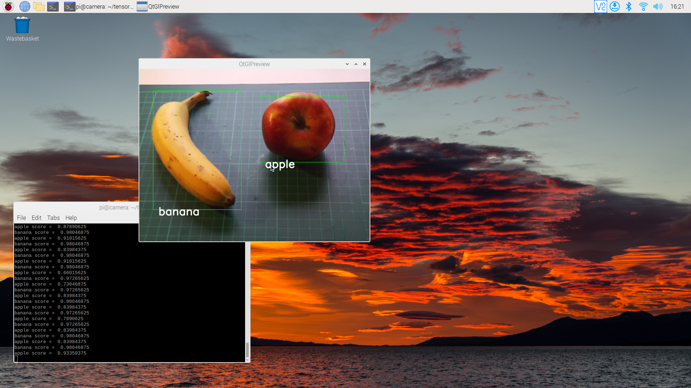

# TensorFlow Lite Example

TensorFlow Lite inferencing examples that carry out real-time object detection and labelling in a QT preview window using the [MobileNet V2](https://arxiv.org/abs/1801.04381) network trained on the [COCO dataset](https://cocodataset.org/#home).

## Installing Picamera2

Ensure that you have installed the Picamera2 library along with OpenCV. 

```
$ sudo apt update
$ sudo apt install -y libboost-dev
$ sudo apt install -y libgnutls28-dev openssl libtiff5-dev
$ sudo apt install -y qtbase5-dev libqt5core5a libqt5gui5 libqt5widgets5
$ sudo apt install -y meson
$ sudo pip3 install pyyaml ply
$ sudo pip3 install --upgrade meson
$ sudo apt install -y libglib2.0-dev libgstreamer-plugins-base1.0-dev
$ git clone --branch picamera2 git@github.com:raspberrypi/libcamera.git
$ cd libcamera
$ meson build --buildtype=release -Dpipelines=raspberrypi -Dipas=raspberrypi -Dv4l2=true -Dgstreamer=enabled -Dtest=false -Dlc-compliance=disabled -Dcam=disabled -Dqcam=enabled -Ddocumentation=disabled -Dpycamera=enabled
$ ninja -C build 
$ sudo ninja -C build install
$ cd
$ git clone git@github.com:tomba/kmsxx.git
$ cd kmxss
$ git submodule update --init
$ sudo apt install -y libfmt-dev libdrm-dev
$ meson build
$ ninja -C build
$ cd
$ sudo pip3 install pyopengl
$ sudo apt install python3-pyqt5
$ git clone git@github.com:raspberrypi/picamera2.git
$ sudo pip3 install opencv-python==4.4.0.46
$ sudo apt install -y libatlas-base-dev
$ sudo pip3 install numpy --upgrade
$ export PYTHONPATH=/home/pi/picamera2:/home/pi/libcamera/build/src/py:/home/pi/kmsxx/build/py
```

**NOTE:** Instructions are for the 32-bit version of Raspberry Pi OS.

## Installing TensorFlow Lite

Then [install the TensorFlow Lite runtime](https://www.tensorflow.org/lite/guide/python) library and other dependencies.

```
$ sudo apt update
$ sudo apt install build-essentials
$ sudo apt install git
$ sudo apt install libatlas-base-dev
$ sudo apt install python3-pip

$ pip3 install tflite-runtime
$ pip3 install pillow
$ pip3 install numpy
```

## Running the example



Choose the example with or without labels and run it on the command line as below,

```
$ python3 real_time_with_labels.py --model mobilenet_v2.tflite --label coco_labels.txt
```